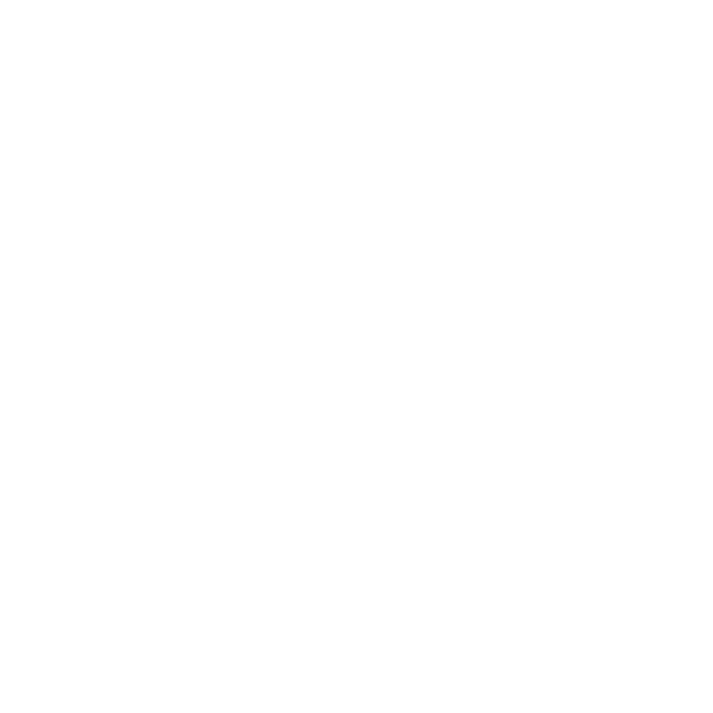

# dotlock

A macOS desktop app for managing `.env` files across your projects. dotlock encrypts your environment variables into a single vault file, watches for file changes on disk, and optionally protects your vault password with Touch ID.

**[Download dotlock for macOS](https://dotlock.dev)** — free, no account required.

## Features

- **Encrypted vault** — All secrets stored in a single `.dotlock` file using AES-256-GCM with scrypt key derivation
- **Multi-repo management** — Track `.env` files across multiple projects from one place
- **Drift detection** — Watches files on disk and alerts you when they change or go missing
- **Touch ID support** — Store your vault password in the macOS Keychain with biometric unlock
- **Import & restore** — Pull env files into the vault or push vault contents back to disk
- **Provider detection** — Automatically tags keys by provider (AWS, Stripe, Vercel, etc.)

## Getting Started

Requires [Bun](https://bun.sh) on macOS.

```bash
# Install dependencies
bun install

# Development with hot reload
bun run dev:hmr

# Development without HMR
bun run dev

# Run tests
bun test
```

## Building

```bash
# Build the keychain helper (requires Apple Developer certificate)
bun run build:helpers

# Production build
bun run build:canary
```

The keychain helper is a signed Swift binary that handles Touch ID and Keychain access. Building it requires an Apple Developer certificate and a provisioning profile at `tools/keychain-helper.provisionprofile`.

## Project Structure

```
src/
├── bun/           # Main process — vault, crypto, file watcher, keychain
├── mainview/      # React frontend — UI components, routing, RPC client
└── shared/        # Shared type definitions
tools/             # Swift keychain helper source and build script
```

## How It Works

dotlock runs as an [Electrobun](https://electrobun.dev) app. The main process handles encryption, file watching, and Keychain access. The frontend communicates with it over a typed RPC layer.

Vault files use a custom binary format (`.dotlock`) containing scrypt KDF parameters, an AES-256-GCM encrypted payload, and an authentication tag. The entire vault — all repos and their env files — is serialized as JSON and encrypted as a single blob.

File watching uses directory-level `fs.watch` (FSEvents on macOS) with debouncing, so it survives atomic writes and editor save patterns.

## Tech Stack

Electrobun · React · TypeScript · Tailwind CSS · Vite · Bun · Swift (keychain helper) · Biome (lint/format)

## License

[MIT](https://opensource.org/licenses/MIT)
